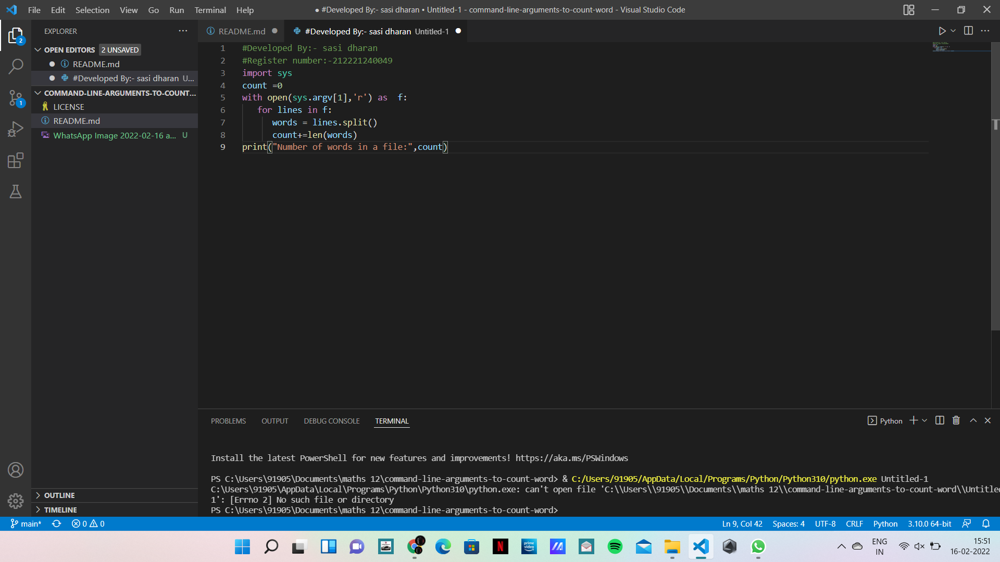
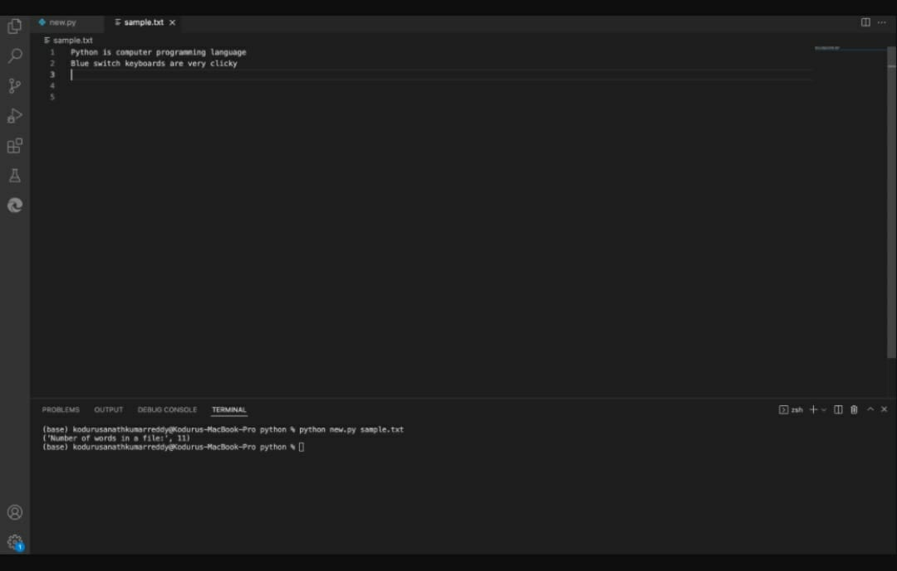

# command-line-arguments-to-count-word
## AIM:
To write a python program for getting the word count from the contents of a file using command line arguments.
## EQUIPEMENT'S REQUIRED: 
PC
Anaconda - Python 3.7
## ALGORITHM: 
[3:41 pm, 16/02/2022] Harish Sec: Step 1:
import sys

Step 2:
Assign a variable count =0

Step 3:
open a file in read mode

Step 4:
iterate a variable(lines) through the file

Step 5:
Assign a variable words = lines.split()

Step 6:
Now iterate through the variable and increase the count: and print the count value

PROGRAM:
~ #Developed By:- sasi dharan 
#Register number:-212221240049
import sys
count =0 
with open(sys.argv[1],'r') as  f:
   for lines in f: 
      words = lines.split() 
      count+=len(words)
print("Number of words in a file:",count)
~
### OUTPUT:

## RESULT:
Thus the program is written to find the word count from the contents of a file using command line arguments.
